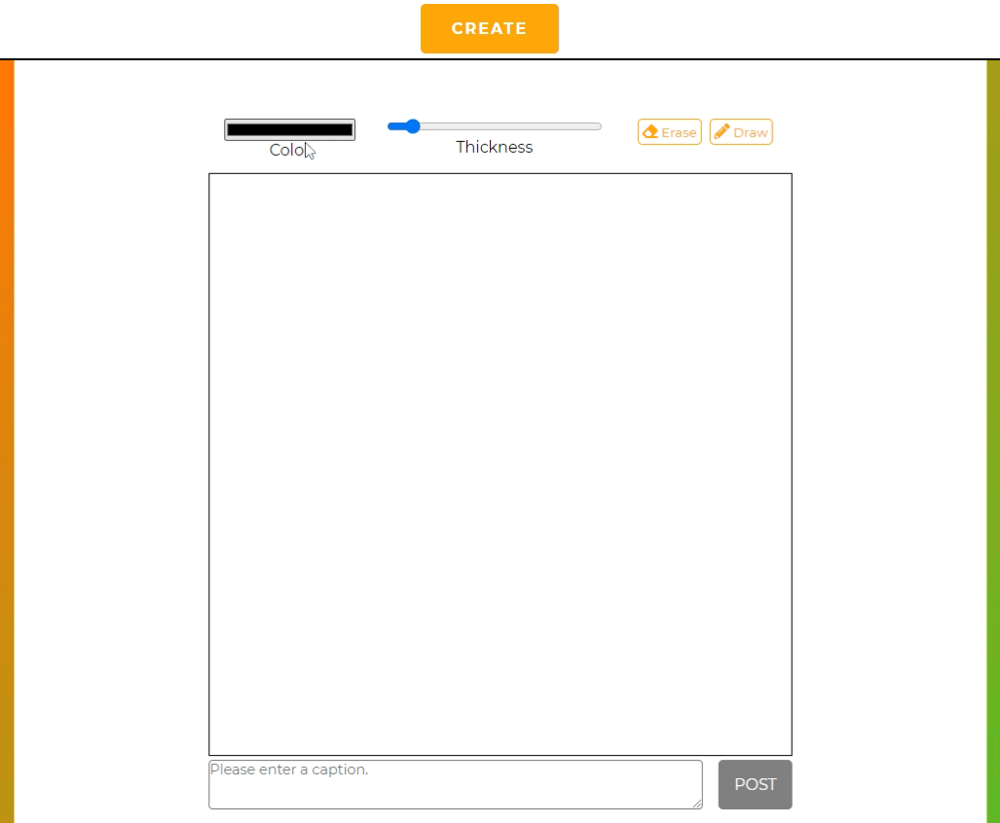
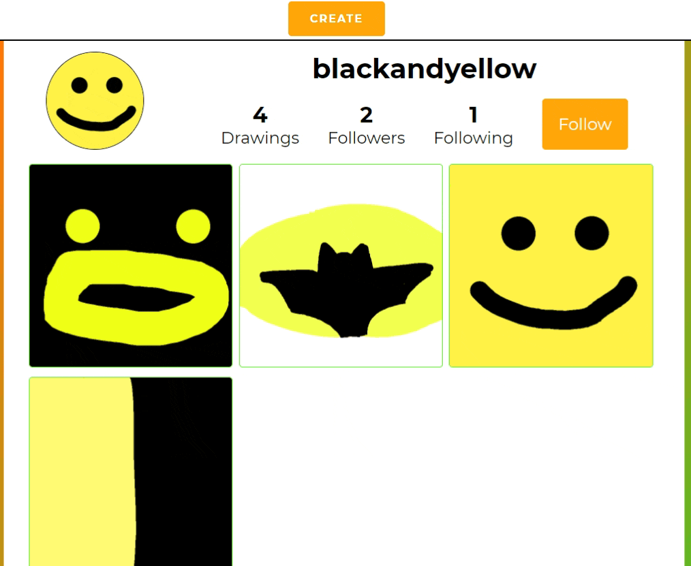
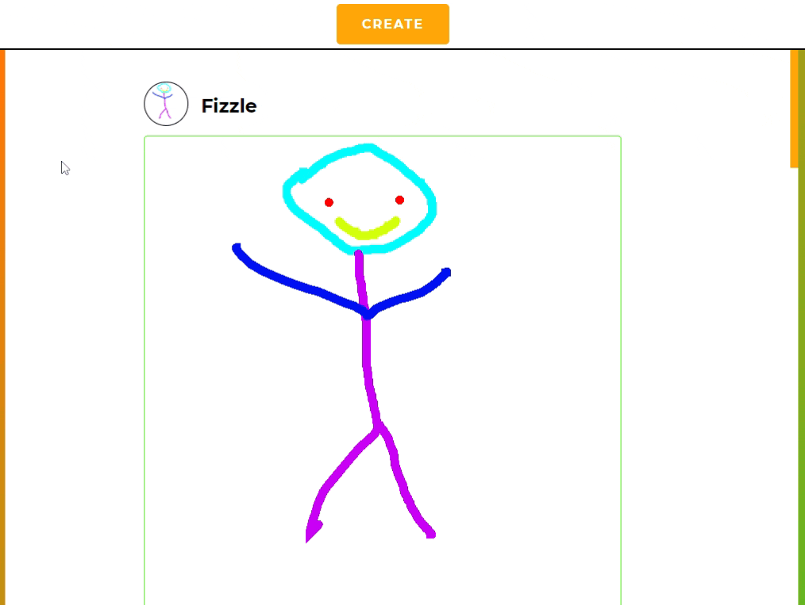

# Tap Sketch

Tap Sketch is a full stack web application where budding artists can come together, create their own simple artworks, and share them with the community!

To see it in action, please click [here](http://tap-sketch.herokuapp.com/)!

## Features

Users can tap into a fully interactive HTML Canvas element to create their very own artworks from scratch!

<p align="center">
   
</p>

Users can head over to their friends' profile pages and begin following one another to keep track of one another's latest artworks!

<p align="center">
   
</p>

Once users have built up a good selection of artists to follow, they can head over to their home page to get a feed of their followed users' latest artworks.

<p align="center">
   
</p>

## Installing this App

1. Clone this repository

   ```bash
   git clone https://github.com/darabandev/tap-sketch.git
   ```

2. Install dependencies

   ```bash
   pipenv install --dev -r dev-requirements.txt && pipenv install -r requirements.txt
   ```

3. Create a **.env** file based on the example with proper settings for your
   development environment
4. Setup your PostgreSQL user, password and database and make sure it matches your **.env** file

5. Get into your pipenv, migrate your database, seed your database, and run your flask app

   ```bash
   pipenv shell
   ```

   ```bash
   flask db upgrade
   ```

   ```bash
   flask seed all
   ```

   ```bash
   flask run
   ```

6. To run the React App in development, checkout the [README](./react-app/README.md) inside the `react-app` directory.

---

_IMPORTANT!_
If you add any python dependencies to your pipfiles, you'll need to regenerate your requirements.txt before deployment.
You can do this by running:

```bash
pipenv lock -r > requirements.txt
```

_ALSO IMPORTANT!_
psycopg2-binary MUST remain a dev dependency because you can't install it on apline-linux.
There is a layer in the Dockerfile that will install psycopg2 (not binary) for us.

---

## Deploy to Heroku

1. Create a new project on Heroku
2. Under Resources click "Find more add-ons" and add the add on called "Heroku Postgres"
3. Install the [Heroku CLI](https://devcenter.heroku.com/articles/heroku-command-line)
4. Run

   ```bash
   heroku login
   ```

5. Login to the heroku container registry

   ```bash
   heroku container:login
   ```

6. Update the `REACT_APP_BASE_URL` variable in the Dockerfile.
   This should be the full URL of your Heroku app: i.e. "https://flask-react-aa.herokuapp.com"

7. If you're running WSL1, scroll to the bottom of this readme for proper steps.

   Push your docker container to heroku from the root directory of your project.
   This will build the dockerfile and push the image to your heroku container registry

   ```bash
   heroku container:push web -a {NAME_OF_HEROKU_APP}
   ```

8. Release your docker container to heroku

   ```bash
   heroku container:release web -a {NAME_OF_HEROKU_APP}
   ```

9. set up your database:

   ```bash
   heroku run -a {NAME_OF_HEROKU_APP} flask db upgrade
   heroku run -a {NAME_OF_HEROKU_APP} flask seed all
   ```

10. Under Settings find "Config Vars" and add any additional/secret .env variables.

11. profit

---

### WSL1 heroku push through powershell:

If you have docker installed in your powershell and not in your wsl terminal, the following replace step 7 in the deploy section of your project readme “Deploy to Heroku” section:

7a. cd into the root of your app in your powershell and build the image from the Dockerfile with a specific tag!

(IF YOU ARE DEPLOYING FOR THE SECOND TIME, you must delete the older version of this image with `docker image rm registry.heroku.com/<app_name>/web` before you build)

`docker build --tag registry.heroku.com/<app_name>/web .`

7b. Push that newly built image to heroku:

`docker push registry.heroku.com/<app_name>/web`

Continue with step 8 in the readme
